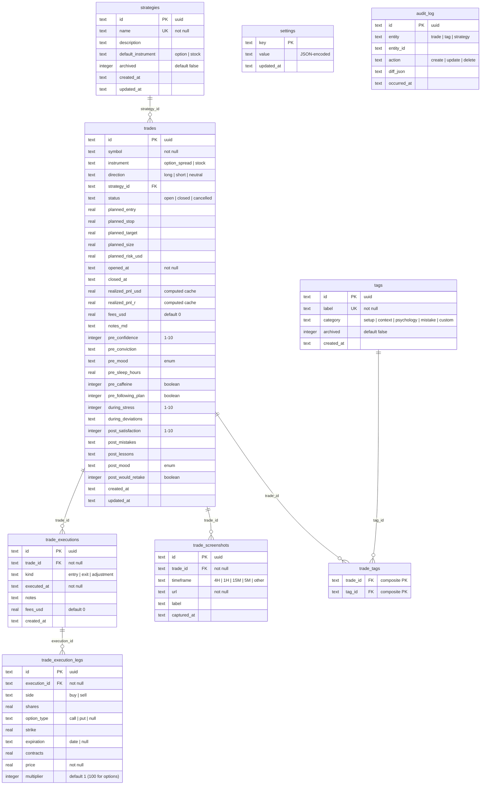

# pk_trades — Build Plan

> Phase 0 deliverable. No code until this plan is reviewed and acknowledged.

---

## Open questions (answer before Phase 1)

### 1. Render plan — Starter ($7/mo) + 1 GB persistent disk (~$0.25/mo)?

**Recommendation: Yes, use Starter + persistent disk.**
SQLite requires a real filesystem. Render's free tier wipes on every deploy, so the database would vanish. Starter with a 1 GB disk is the cheapest path that actually works. 1 GB is more than enough — a SQLite database with 10,000 trades, executions, legs, screenshots, tags, and audit log entries will be well under 100 MB.

### 2. Domain — custom domain or pk-trades.onrender.com?

**Recommendation: Start with pk-trades.onrender.com.**
Zero config, zero cost. A custom domain can be added to Render at any time (free on Starter) — no code change required, just a DNS CNAME. No reason to block Phase 1 on this.

### 3. Single user only, or leave room for a future second account?

**Recommendation: Single user. No multi-user scaffolding.**
The spec says "single-user trade journal… not a SaaS." Adding a user_id column to every table, a user registration flow, and row-level scoping would be premature complexity that makes every query slower to write and harder to test. If a second user is ever needed, it's simpler to run a second instance than to retrofit multi-tenancy.

### 4. Equity curve — start from starting_balance or from zero?

**Recommendation: Start from starting_balance.**
The equity curve should plot the account value over time: starting_balance + cumulative realized P&L. This makes percentage returns meaningful (a $500 gain on a $25,000 account is 2%, not infinity). The Y-axis label should be "Account value ($)" not "P&L ($)." A separate cumulative P&L line (starting from zero) can be an optional toggle if useful, but the primary view should be the real account value.

### 5. Multi-leg spreads — net credit per spread or leg-by-leg premiums?

**Recommendation: Leg-by-leg.**
Each leg (buy/sell, call/put, strike, expiration, contracts, price) is entered individually. This is more work upfront but:
- The data is correct and granular — you can reconstruct the net credit/debit from legs.
- It handles iron condors (4 legs), adjustments (rolling one leg), and partial fills naturally.
- P&L calculation per leg enables richer analytics (e.g., which leg was mispriced).
- The UI can still display the computed net credit/debit prominently so the trader sees the number they care about.

### 6. Timezone — confirm America/Chicago (CT)?

**Recommendation: Default to America/Chicago.**
All timestamps stored as UTC in SQLite. Display conversion uses the timezone setting. The settings page lets you change it at any time (e.g., if you travel or relocate). Market hours logic (if ever added) would reference exchange timezone, not user timezone.

### 7. Backup retention — 30 daily snapshots acceptable?

**Recommendation: 30 days is solid.**
At ~100 KB–10 MB per snapshot, 30 copies fit easily in the 1 GB disk alongside the live database. The nightly cron deletes the oldest backup when count exceeds 30. If you want more safety, we can add a weekly "archive" tier that keeps one snapshot per week for 90 days — but 30 daily is a good starting point.

---

## Build understanding

pk_trades is a private, single-user trade journal for a trader who runs credit spreads (multi-leg options) and stock scalps with real capital. It is not a demo, not a SaaS, and not a portfolio piece. It is a tool that must be precise, fast, and visually distinctive.

### Core problem it solves

After each trade, the trader needs to:
1. Log the trade with full execution detail (multi-leg, multi-fill, pyramiding, scaling out).
2. Capture the reasoning, psychology, and plan adherence around the trade.
3. Attach chart screenshots at multiple timeframes.
4. Review historical trades with rich filtering.
5. See computed metrics that slice performance by strategy, symbol, tag, day of week, hour, mood, and other dimensions.
6. Sync the production database to a local dev environment for development.

### Key technical constraints

- **Full-stack TypeScript (strict), Next.js 15 App Router, SQLite via better-sqlite3, Drizzle ORM.**
- Single-file SQLite on a Render persistent disk — the entire data layer is in-process, no external database.
- P&L is derived from executions and legs, never user-entered. The computation must handle spreads, pyramiding, partial exits, fees, and rounding correctly.
- Every metric is a pure function with edge-case unit tests.
- The design must not look AI-generated. No gradients, no glassmorphism, no shadcn defaults, no sparkle icons. Three-color palette: black, white, purple. Wins are white, losses are purple.

### What makes this different from a standard CRUD app

1. **Multi-leg execution model.** A trade has executions, and each execution has legs. This three-level hierarchy (trade → execution → leg) is the backbone of the data model and the P&L computation.
2. **P&L is computed, not entered.** The math must be right — real capital is at risk.
3. **Psychology tracking** is a first-class data dimension, not an afterthought. Metrics slice by mood, sleep, confidence, and plan adherence.
4. **The design system is opinionated.** It's not "pick a component library and go." The palette, typography, spacing, and interaction patterns are specified in detail.

---

## Phased milestones

### Phase 0 — Plan (this document)
- [x] Read full spec
- [x] Write PLAN.md with milestones, file tree, data model, open questions
- [x] User reviews and answers open questions
- [x] Update PLAN.md with answers, proceed to Phase 1

### Phase 1 — Foundation ✅
- [x] Initialize repo: `pnpm init`, Next.js 15 (16.2.6), TypeScript strict, Tailwind CSS v4
- [x] Configure Biome 2.4.15 (lint + format, Tailwind CSS directives enabled)
- [x] Configure Lefthook (pre-commit: biome, typecheck, test)
- [x] Configure Vitest 4.1.6
- [x] Configure Playwright 1.60
- [x] Set up GitHub Actions CI (install → typecheck → biome → vitest → playwright → build)
- [x] Create `.env.example`, `.gitignore`
- [x] Empty app shell renders (smoke test) — all routes build, tests pass
- [x] Full check suite green: `pnpm check` (biome + tsc + vitest)
- [x] `pnpm build` passes — all pages render

### Phase 2 — Data layer ✅
- [x] Drizzle config + better-sqlite3 setup (WAL mode, FK enforcement, singleton client)
- [x] Full schema: 9 tables — strategies, tags, trades, trade_executions, trade_execution_legs, trade_screenshots, trade_tags, settings, audit_log
- [x] Migration file: `db/migrations/0000_known_captain_america.sql`
- [x] `pnpm db:migrate` command (idempotent, exits non-zero on failure)
- [x] Seed script with 6 realistic trades: 2 bull put spreads (win+loss), iron condor (win), 2 stock scalps (win+loss), 1 open QQQ spread. Includes partial exits, pyramiding, multi-leg.
- [x] `lib/pnl.ts` — pure P&L computation with cash-flow method: credit/debit spreads, stocks, fees, rounding
- [x] 20 unit tests for pnl.ts covering all topologies
- [x] `lib/metrics/*.ts` — 5 metric modules: headline, distribution, edge, risk, psychology
- [x] 95+ unit tests for metrics with edge cases (zero trades, all wins, all losses, single trade)
- [x] Zod validators: trade, execution, tag, strategy, settings
- [x] 120 tests green, biome clean, typecheck clean, build green

### Phase 3 — Design system ✅
- [x] `globals.css` with full palette (CSS variables), typography scale, reset
- [x] Font setup: Inter (variable), JetBrains Mono
- [x] Base primitives: Button, Input, Select, Dialog, Table, Badge, Slider, Toggle, Tabs
- [x] All primitives built on Radix UI, fully restyled (no shadcn defaults)
- [x] `/design` route showing the full component kit
- [x] Barrel export `components/primitives/index.ts`
- [x] Biome clean, typecheck clean, build green, 120 tests pass

### Phase 4 — Auth + shell ✅
- [x] lib/auth.ts: HMAC-SHA256 session tokens, timing-safe password verify
- [x] Login page (single password field, redirects to /journal on success)
- [x] Auth middleware protecting all routes except /login, /design, /api/auth/*
- [x] API routes: POST /api/auth/login, POST /api/auth/logout
- [x] App shell: left rail (60px collapsed / 220px expanded), navigation
- [x] Mobile: bottom tab bar (Journal, New Trade, Metrics, Settings) below lg (900px)
- [x] Session persistence (30-day cookie), logout
- [x] .env.local for development
- [x] 12 auth unit tests, 132 total tests green

### Phase 5 — New trade + trade detail ✅
- [x] lib/db/queries.ts: full CRUD for strategies, tags, trades, executions, screenshots
- [x] API routes: GET/POST strategies, tags, trades, executions; GET/PATCH/DELETE by ID
- [x] P&L auto-recomputation on execution create/delete
- [x] New trade form: identity, plan, first execution (spread leg builder + stock mode), reasoning, screenshots, pre-trade psychology
- [x] Symbol autocomplete from prior trades
- [x] Inline tag creation in tag picker
- [x] Live R:R calculation
- [x] Trade detail page: header, execution timeline, screenshots, tags + notes, psychology panels (pre/during/post)
- [x] Add execution dialog (entry/exit/adjustment with leg builder)
- [x] Close trade dialog (final exit + post-trade psychology)
- [x] Strategy + tag CRUD APIs (management UI in settings — Phase 7)
- [x] Build green, lint clean, typecheck clean, 132 tests pass

### Phase 6 — Journal list + filters ✅
- [x] Journal page: dense table with all columns (Date, Symbol, Strategy, Dir, R, P&L, Status)
- [x] Sort: newest first (default)
- [x] Filters: symbol input, status/instrument/strategy selects
- [x] Comfortable/dense row toggle
- [x] CSV export (button in header)
- [x] Responsive: hides Strategy and Dir columns on mobile

### Phase 7 — Metrics dashboard ✅
- [x] Headline stats: total P&L, win rate, profit factor, expectancy, avg/median R
- [x] Equity curve chart (Recharts, three-color palette only)
- [x] R-multiple distribution histogram (white=wins, purple=losses)
- [x] Max drawdown ($ and %), longest drawdown duration
- [x] Win/loss streak (current, max)
- [x] Edge slicing tables: by strategy, symbol, day of week, instrument — sortable
- [x] Risk metrics: avg risk, largest single loss, risk-adjusted return, plan adherence rate
- [x] Psychology vs outcome: confidence, mood, sleep, "would retake"
- [x] All metrics are pure functions with 132 unit tests
- [x] Charts use only the pk palette (black, white, purple)
- [x] Settings page: timezone, starting balance, commissions, strategy/tag management
- [x] Settings API (GET/PATCH /api/settings)

### Phase 8 — Deployment ✅
- [x] `render.yaml` with Starter plan, persistent disk, env vars
- [x] Nightly backup cron route (`POST /api/admin/backup`) — VACUUM INTO, keeps 30 backups
- [x] `docs/DEPLOYMENT.md` — step-by-step setup, env vars, rollback procedure
- [ ] Deploy to Render (manual step)
- [ ] Verify persistent disk survives a redeploy
- [ ] Render cron job configured

### Phase 9 — Sync ✅
- [x] `GET /api/admin/db/snapshot` — token auth, VACUUM INTO, stream, rate limit (30s)
- [x] `scripts/db-pull.ts` — backup local, download, integrity check, atomic replace, diff summary
- [x] `scripts/db-push.ts` — "OVERWRITE PRODUCTION" confirmation, server-side backup first
- [x] `docs/DEV.md` — full dev guide with sync instructions, project structure, common commands
- [ ] `SYNC_ON_DEV=1` dev integration (deferred — manual `pnpm db:pull` preferred)

### Phase 10 — Polish ✅
- [x] Empty states: journal (no trades), metrics (no data), minimal copy
- [x] Error boundaries: `app/(app)/error.tsx` + `ErrorBoundary` component
- [x] Loading skeletons: journal, metrics, settings, trade detail pages
- [x] Keyboard shortcuts: `n` new trade, `/` focus search, `g j` journal, `g m` metrics, `g s` settings
- [x] Focus states: `:focus-visible` ring on all interactive elements (in globals.css)
- [x] All docs in `docs/` (DEPLOYMENT.md, DEV.md)

---

## Proposed file tree

```
pk_trades/
├── app/
│   ├── (app)/                        # Authenticated route group
│   │   ├── journal/
│   │   │   └── page.tsx
│   │   ├── trades/
│   │   │   ├── [id]/
│   │   │   │   └── page.tsx
│   │   │   └── new/
│   │   │       └── page.tsx
│   │   ├── metrics/
│   │   │   └── page.tsx
│   │   ├── settings/
│   │   │   ├── page.tsx
│   │   │   ├── strategies/
│   │   │   │   └── page.tsx
│   │   │   └── tags/
│   │   │       └── page.tsx
│   │   └── layout.tsx                # App shell (left rail / bottom tabs)
│   ├── api/
│   │   ├── trades/
│   │   │   ├── route.ts              # GET (list), POST (create)
│   │   │   └── [id]/
│   │   │       └── route.ts          # GET, PATCH, DELETE
│   │   ├── executions/
│   │   │   ├── route.ts              # POST (add execution to trade)
│   │   │   └── [id]/
│   │   │       └── route.ts          # PATCH, DELETE
│   │   ├── tags/
│   │   │   ├── route.ts
│   │   │   └── [id]/
│   │   │       └── route.ts
│   │   ├── strategies/
│   │   │   ├── route.ts
│   │   │   └── [id]/
│   │   │       └── route.ts
│   │   ├── metrics/
│   │   │   └── route.ts              # GET with query params for slicing
│   │   ├── settings/
│   │   │   └── route.ts
│   │   ├── auth/
│   │   │   ├── login/
│   │   │   │   └── route.ts
│   │   │   └── logout/
│   │   │       └── route.ts
│   │   └── admin/
│   │       ├── db/
│   │       │   └── snapshot/
│   │       │       └── route.ts      # GET — prod DB snapshot for sync
│   │       └── backup/
│   │           └── route.ts          # POST — nightly backup cron
│   ├── design/
│   │   └── page.tsx                  # Design system showcase (Phase 3)
│   ├── login/
│   │   └── page.tsx
│   ├── layout.tsx                    # Root layout
│   └── globals.css                   # Palette, typography, resets
├── components/
│   ├── primitives/                   # Restyled Radix primitives
│   │   ├── button.tsx
│   │   ├── input.tsx
│   │   ├── select.tsx
│   │   ├── dialog.tsx
│   │   ├── table.tsx
│   │   ├── badge.tsx
│   │   ├── slider.tsx
│   │   └── toggle.tsx
│   ├── trade/
│   │   ├── trade-form.tsx
│   │   ├── leg-builder.tsx
│   │   ├── execution-timeline.tsx
│   │   ├── psychology-panel.tsx
│   │   ├── screenshot-strip.tsx
│   │   └── tag-picker.tsx
│   ├── metrics/
│   │   ├── equity-curve.tsx
│   │   ├── r-histogram.tsx
│   │   ├── stat-card.tsx
│   │   └── edge-table.tsx
│   └── shell/
│       ├── left-rail.tsx
│       ├── bottom-tabs.tsx
│       └── nav-item.tsx
├── lib/
│   ├── db/
│   │   ├── client.ts                 # better-sqlite3 instance
│   │   ├── schema.ts                 # Drizzle table definitions
│   │   └── migrate.ts                # Migration runner
│   ├── pnl.ts                        # Pure P&L computation
│   ├── metrics/
│   │   ├── headline.ts               # Win rate, profit factor, expectancy, etc.
│   │   ├── distribution.ts           # Drawdown, streaks, R histogram data
│   │   ├── edge.ts                   # Slicing by strategy, symbol, tag, etc.
│   │   ├── risk.ts                   # Risk metrics
│   │   └── psychology.ts             # Psychology vs outcome
│   ├── validators/
│   │   ├── trade.ts
│   │   ├── execution.ts
│   │   ├── tag.ts
│   │   ├── strategy.ts
│   │   └── settings.ts
│   ├── auth.ts                       # HMAC cookie signing, session check
│   └── time.ts                       # Timezone conversion helpers
├── db/
│   └── migrations/                   # Drizzle migration SQL files
├── scripts/
│   ├── db-pull.ts
│   ├── db-push.ts
│   └── seed.ts
├── tests/
│   ├── unit/
│   │   ├── pnl.test.ts
│   │   ├── metrics/
│   │   │   ├── headline.test.ts
│   │   │   ├── distribution.test.ts
│   │   │   ├── edge.test.ts
│   │   │   ├── risk.test.ts
│   │   │   └── psychology.test.ts
│   │   └── validators/
│   │       └── trade.test.ts
│   ├── integration/
│   │   ├── api/
│   │   │   ├── trades.test.ts
│   │   │   ├── executions.test.ts
│   │   │   ├── tags.test.ts
│   │   │   ├── strategies.test.ts
│   │   │   └── admin.test.ts
│   │   └── migrations.test.ts
│   └── e2e/
│       ├── trade-flow.spec.ts
│       ├── journal.spec.ts
│       └── mobile.spec.ts
├── docs/
│   ├── ARCHITECTURE.md
│   ├── DEPLOYMENT.md
│   ├── DATA_MODEL.md
│   ├── METRICS.md
│   └── DEV.md
├── public/
├── render.yaml
├── .env.example
├── .gitignore
├── biome.json
├── lefthook.yml
├── drizzle.config.ts
├── next.config.ts
├── playwright.config.ts
├── vitest.config.ts
├── tsconfig.json
├── package.json
├── pnpm-lock.yaml
├── PLAN.md
└── README.md
```

---

## Data model — ERD



### Relationship summary

- **strategies → trades**: One strategy has many trades. A trade has one strategy (optional — in case a scalp doesn't fit a named strategy, `strategy_id` can be null).
- **trades → trade_executions**: One trade has many executions (entry, exit, adjustment). Supports pyramiding (multiple entries) and scaling out (multiple partial exits).
- **trade_executions → trade_execution_legs**: One execution has many legs. A stock trade has one leg. A bull put spread has two legs. An iron condor has four legs.
- **trades → trade_screenshots**: One trade has many screenshots, one per timeframe slot.
- **trades ↔ tags** (via trade_tags): Many-to-many. A trade can have multiple tags; a tag can be on multiple trades. ON DELETE RESTRICT on tag_id prevents deleting a tag that's in use (archive instead).
- **settings**: Key-value store for app configuration. No foreign keys.
- **audit_log**: Append-only log of all mutations. References entity type and ID but no foreign key constraint (the entity may be deleted).

### P&L computation flow

```
trade
  └─ executions[] (entry, exit, adjustment)
       └─ legs[] (buy/sell, price, quantity, multiplier)

lib/pnl.ts:
  1. Gather all legs across all executions for a trade
  2. Net position per unique contract (symbol + option_type + strike + expiration)
     or per symbol for stocks
  3. Realized P&L = sum of (exit_price - entry_price) × quantity × multiplier × direction_sign
  4. Subtract total fees (sum of execution fees + trade-level fees)
  5. R-multiple = realized_pnl_usd / planned_risk_usd (null if no planned risk)
  6. Cache results back to trades.realized_pnl_usd and trades.realized_pnl_r
```

### SQLite-specific notes

- All IDs are UUIDs stored as TEXT (SQLite has no native UUID type).
- All timestamps are stored as ISO 8601 TEXT in UTC. Display conversion happens in the application layer using the user's timezone setting.
- Booleans are stored as INTEGER (0/1) — SQLite convention.
- Enums are stored as TEXT with Zod validation at the application boundary.
- `PRAGMA journal_mode = WAL` will be set on connection for concurrent read performance.
- `PRAGMA foreign_keys = ON` must be set on every connection (SQLite disables FK enforcement by default).

---

## Decisions log

This section will be updated after each phase with decisions made during implementation.

| Date | Phase | Decision | Rationale |
|------|-------|----------|-----------|
| 2026-05-20 | 0 | Plan written, awaiting review | — |
| 2026-05-20 | 0 | All open questions accepted with recommended answers | User acknowledged |
| 2026-05-20 | 1 | Next.js 16.2.6 (latest stable) | `create-next-app@latest` pulled this |
| 2026-05-20 | 1 | Biome 2.4.15 with tailwindDirectives | Biome 2.x changed config schema; CSS Tailwind support needed |
| 2026-05-20 | 1 | Tab indentation (Biome formatter) | Consistent with Next.js defaults |
| 2026-05-20 | 1 | Removed ESLint entirely | Biome replaces ESLint + Prettier per spec |
| 2026-05-20 | 1 | `noUncheckedIndexedAccess: true` in tsconfig | Extra strictness for array/object indexing |
| 2026-05-20 | 2 | P&L uses cash-flow summation method | Sum all cash flows (sell=positive, buy=negative), subtract fees. Works for all trade types uniformly. |
| 2026-05-20 | 2 | Zod v4 (`zod/v4` import) | Latest Zod with improved perf and `z.iso.datetime()` |
| 2026-05-20 | 2 | Metrics exclude open trades | `closedTrades()` filter ensures metrics only count realized P&L |
| 2026-05-20 | 2 | tradeTags has no composite PK in Drizzle | SQLite + Drizzle composite PKs are complex; using dual FKs with onConflictDoNothing |

---

## Notes

- The spec locks the tech stack. No substitutions without discussion.
- The three-color palette (black/white/purple) and win=white/loss=purple mapping are non-negotiable.
- P&L correctness is the highest priority. Every math path gets unit tests.
- No telemetry, no analytics, no third-party tracking, no "AI" copy in the UI.
